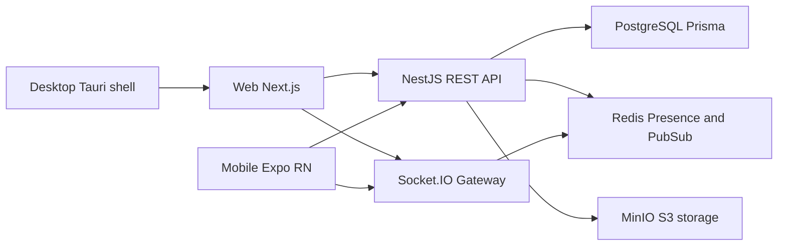

# План реализации Telegram-lite

Источник требований: `telegram_lite_spec_for_ai.md`.

## 1. Зафиксированные границы первой версии

### In scope
- Регистрация/логин/рефреш/логаут
- Профиль + уникальный username
- Поиск пользователей по username
- Direct-чат 1:1
- Отправка текста и изображений
- История сообщений с cursor pagination
- Realtime: new message, delivered, read, typing, online/offline
- Web + Mobile + Desktop
- Docker Compose для локального запуска
- Базовые unit/integration/e2e + smoke check

### Out of scope
- Группы, каналы, звонки, боты, сторис, voice messages
- Production-grade E2E encryption
- Вложения кроме изображений

### Definition of Done v1
- Проект поднимается по инструкции
- Backend, web, mobile, desktop запускаются
- Все ключевые сценарии проходят end-to-end
- Критические/блокирующие баги устранены после smoke-фазы

---

## 2. Архитектурная рамка

### Monorepo
```text
/apps
  /server
  /web
  /mobile
  /desktop
/packages
  /types
  /api-client
  /realtime-client
  /ui
  /utils
  /config
```

### Поток взаимодействия


---

## 3. Поэтапный roadmap с merge-критериями

## Этап 0. Foundation monorepo

### Задачи
- Инициализация workspace, package manager, shared tsconfig/eslint/prettier
- Создание каркаса `/apps/*` и `/packages/*`
- Базовые команды: lint, typecheck, test, build

### Merge-критерии
- Все workspace-пакеты резолвятся
- `lint/typecheck/build` выполняются без ошибок на пустом каркасе

---

## Этап 1. Backend skeleton и инфраструктура

### Задачи
- NestJS app + модульная структура: auth/users/profiles/search/chats/messages/uploads/realtime/presence/notifications/common
- Подключение Prisma + PostgreSQL
- Подключение Redis
- Подключение MinIO клиентом S3-compatible
- Базовый health endpoint и конфигурация env

### Merge-критерии
- Сервер стартует локально
- Подключения к Postgres/Redis/MinIO валидируются health-check
- Prisma миграции применяются

---

## Этап 2. Данные и миграции

### Задачи
- Prisma schema для users/chats/chat_members/messages/message_attachments/message_statuses/refresh_tokens/files
- Индексы и уникальные ограничения
- Бизнес-ограничение уникальности direct-чата
- Seed-скрипт для dev

### Merge-критерии
- Миграции чисто накатываются на пустую БД
- Индексы/уникальности проверены интеграционными тестами
- Seed создает валидный тестовый набор

---

## Этап 3. Auth + Users/Profile + Search

### Задачи
- Auth: register/login/refresh/logout + JWT guard
- Хеширование паролей argon2 или bcrypt
- Refresh token rotation и revoke
- Profiles: get/update profile, update avatar, username validation
- Search users по `username_normalized`, debounce-friendly endpoint

### Merge-критерии
- E2E: register/login/refresh/logout проходит
- Username валидируется regex и уникальностью
- Search возвращает корректные результаты case-insensitive

---

## Этап 4. Chats + Messages REST

### Задачи
- Создание/получение direct-чата
- Список чатов с last message + unread count
- Отправка текстового и image/text_image сообщений
- История сообщений с cursor pagination
- Message statuses sent/delivered/read
- Idempotency через `clientMessageId`

### Merge-критерии
- Нельзя создать дубликат direct-чата для пары пользователей
- Cursor pagination стабильна при догрузке
- Отправка сообщений проходит интеграционные тесты

---

## Этап 5. Realtime и Presence

### Задачи
- Socket.IO gateway + auth по токену
- События: `new_message`, `message_delivered`, `message_read`, `user_typing`, `user_online`, `user_offline`, `chat_updated`
- Redis для presence и меж-инстансовой координации
- Проверка доступа к chat room

### Merge-критерии
- Два клиента получают realtime-события в корректном порядке
- Статусы delivered/read синхронно видны отправителю и получателю
- Presence корректно обновляется при connect/disconnect

---

## Этап 6. Uploads images

### Задачи
- Endpoint загрузки изображений
- Валидация mime/size, запрет исполняемых файлов
- Генерация storage key без оригинального имени
- Сохранение метаданных в `files` и привязка к message attachments
- Публичный URL или signed URL стратегия

### Merge-критерии
- Загружаются только допустимые изображения
- Некорректные файлы отклоняются с понятными ошибками
- Изображение отображается в сообщении после отправки

---

## Этап 7. Shared packages

### Задачи
- `packages/types`: DTO, entity contracts, socket event payloads
- `packages/api-client`: типизированный REST клиент
- `packages/realtime-client`: типизированный socket client
- `packages/ui`: базовые компоненты и токены

### Merge-критерии
- Клиенты используют shared типы без дублирования
- Breaking changes контрактов ловятся typecheck

---

## Этап 8. Web client Next.js

### Задачи
- Экраны: auth, chats list, chat, profile, search
- TanStack Query + store для session/socket/ui state
- Optimistic UI для отправки сообщений
- Light/dark theme
- Двухколоночный layout

### Merge-критерии
- Web покрывает все обязательные пользовательские сценарии
- Оптимистичные сообщения подтверждаются сервером и корректно заменяются

---

## Этап 9. Mobile Expo RN

### Задачи
- Навигация: chats list, chat screen, profile, search
- Safe area, image picker, адаптация UX
- Realtime и optimistic flow аналогичны web

### Merge-критерии
- Mobile проходит те же ключевые сценарии, что web
- Отправка изображений работает через нативный picker

---

## Этап 10. Desktop Tauri

### Задачи
- Обертка web-клиента в Tauri
- Конфигурация desktop-сборки
- Минимальные desktop-specific настройки

### Merge-критерии
- Desktop-сборка запускается локально
- Ключевые сценарии чата работают в desktop

---

## Этап 11. Тестирование

### Задачи
- Unit: auth, username validation, chat uniqueness, status transitions
- Integration: register/login, search, create chat, send text/image, pagination
- E2E: пользователь A/B, realtime delivery/read

### Merge-критерии
- Обязательные unit/integration/e2e наборы проходят в CI в чистом окружении
- Все 12 обязательных пользовательских сценариев имеют явные автотесты или формализованные smoke-check шаги с ожидаемым результатом
- Покрыты негативные кейсы: невалидный JWT, невалидный refresh token, недопустимый upload mime/size, доступ к чужому чату
- В тестах подтверждается инвариант unique direct-chat для пары пользователей
- Cursor pagination проверена на корректность порядка, отсутствия дублей и пропусков
- Realtime тесты валидируют порядок событий: new_message -> delivered -> read
- Повторный прогон тестов подряд дает идентичный результат без флейков в критических сценариях
- PR не может быть слит без зеленых статусов lint/typecheck/test/build

---

## Этап 12. DevOps и release readiness

### Задачи
- Docker Compose: postgres, redis, minio, server, web
- `.env.example` для всех apps
- GitHub Actions: lint/typecheck/test/build
- Базовый release checklist

### Merge-критерии
- Локальный подъем одним compose
- CI зеленый по обязательным джобам

---

## Этап 13. Стабилизация перед сдачей

### Задачи
- Полный цикл: build -> run -> smoke -> bugfix -> retest
- Проверка 12 обязательных сценариев из ТЗ
- Исправление блокеров интеграции и UX-поломок

### Merge-критерии
- Выполнены минимум два полных последовательных цикла build/run/smoke/fix/retest без появления новых блокеров
- Все 12 обязательных сценариев из ТЗ проходят на web/mobile/desktop с зафиксированными артефактами проверки
- Реaltime подтвержден на двух сессиях разных пользователей: доставка, read-status, online/offline, typing
- Нет критических и high-severity дефектов в bug list, все medium имеют документированный workaround
- Отсутствуют несостыковки API и клиентов: версии контрактов синхронизированы, typecheck на всех apps/packages зеленый
- Проверены и задокументированы rollback шаги для последней стабильной версии миграций
- Документация запуска соответствует фактическому состоянию и воспроизводима на чистом окружении
- Release checklist подписан: infra health, observability, security baseline, smoke evidence

---

## 4. Порядок реализации между командами

1. Platform/Core: этапы 0-2
2. Backend/API: этапы 3-6
3. Shared: этап 7
4. Clients: этапы 8-10
5. Quality/DevOps: этапы 11-12
6. Stabilization: этап 13

---

## 5. Риски и профилактика

- Риск рассинхронизации REST и WS контрактов -> единый `packages/types`
- Риск дублирования direct-чатов -> бизнес-constraint + тесты уникальности
- Риск нестабильного optimistic UI -> обязательный `clientMessageId` и ack mapping
- Риск drift между платформами -> общие api/realtime clients и единые smoke-сценарии
- Риск проблем загрузки медиа -> строгая валидация + ограничения размера + наблюдаемость ошибок

---

## 6. Контрольная матрица приемки v1

- Auth: register/login/refresh/logout
- Profile: get/update, username uniqueness
- Search: case-insensitive username lookup
- Chats: unique direct chat creation
- Messages: text/image send + history pagination
- Realtime: delivery/read + online/offline + typing
- Clients: web/mobile/desktop functional parity по ключевым сценариям
- Ops: dockerized local startup + CI baseline

---

## 7. Post-v1 roadmap улучшений с приоритизацией

### P0 Reliability and Contract Safety

#### 7.1 Дедупликация сообщений и устойчивый retry
- Ввести серверную дедупликацию по `clientMessageId` с Redis TTL-key и audit log коллизий
- Ввести client retry policy c backoff и обязательным re-sync статусов после reconnect

#### Merge-критерии P0-1
- Повторная отправка одного `clientMessageId` не создает дубль в БД и возвращает тот же canonical `messageId`
- Интеграционный тест подтверждает idempotent поведение при 3 подряд повторных send-запросах
- После принудительного разрыва сокета клиент восстанавливает сессию и синхронизирует delivered/read без рассинхрона
- p95 delivery lag под нагрузкой в тестовом профиле не деградирует относительно v1 baseline

#### 7.2 Контрактные тесты REST и WS
- Зафиксировать schema contracts для REST DTO и websocket payloads
- Добавить consumer-driven contract tests между `apps/server` и клиентами

#### Merge-критерии P0-2
- Любое breaking-изменение DTO/event payload блокирует CI
- Версии контрактов REST/WS синхронизированы и опубликованы в `packages/types`
- Генерация SDK из OpenAPI проходит без ручных правок

---

### P1 Observability and Operations

#### 7.3 SLO и end-to-end трассировка
- Ввести корреляционные идентификаторы `requestId/sessionId/messageId`
- Снять дашборды: API latency, websocket reconnect rate, delivery lag, upload fail rate

#### Merge-критерии P1-1
- Для каждого пользовательского сценария trace связывает API + WS + DB-операции
- Настроены alert rules для SLO-нарушений с documented runbook
- Ошибки uploads и realtime имеют структурированные логи с контекстом пользователя и чата

#### 7.4 Release safety и rollback
- Ввести preview environments на PR
- Ввести canary deployment и авто-rollback по error budget

#### Merge-критерии P1-2
- Каждый PR имеет изолированное preview-окружение с автоматическим smoke check
- Canary rollout автоматически откатывается при превышении error threshold
- Документированный rollback миграций подтвержден rehearsal-прогоном

---

### P2 UX and Data Lifecycle

#### 7.5 Offline-first отправка
- Добавить офлайн-очередь отправки и состояние failed/retry для сообщений и вложений
- Добавить reconciliation pending state после reconnect

#### Merge-критерии P2-1
- Сообщения, отправленные офлайн, досылаются в исходном порядке после восстановления сети
- UI явно показывает pending/failed/retry и не теряет draft/attachment
- Нет дублей сообщений после повторной синхронизации

#### 7.6 Политики хранения данных
- Ввести retention policy для messages/files и cleanup orphaned attachments
- Ввести периодические задачи верификации ссылочной целостности

#### Merge-критерии P2-2
- Cleanup job удаляет orphaned attachments без удаления валидных данных
- Retention задачи выполняются по расписанию и логируют результат
- Проверка ссылочной целостности проходит без критических нарушений

---

## 8. Последовательность внедрения post-v1

1. P0-1 Дедупликация и retry/re-sync
2. P0-2 Контрактные тесты и versioned contracts
3. P1-1 Observability и SLO
4. P1-2 Release safety и rollback rehearsal
5. P2-1 Offline-first UX
6. P2-2 Data lifecycle и cleanup

### Глобальные критерии готовности post-v1
- Нет critical/high дефектов в релизной ветке
- Все merge-критерии раздела `Post-v1 roadmap` выполнены
- CI обязателен: `lint`, `typecheck`, `test`, `build`, contract tests, smoke tests
- Есть подтвержденные артефакты: отчеты тестов, дашборды SLO, логи rollback rehearsal
